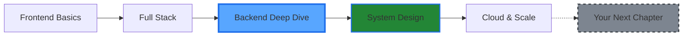

<div align="center">

```
     ██╗ █████╗ ████████╗ █████╗ ███╗   ██╗    
     ██║██╔══██╗╚══██╔══╝██╔══██╗████╗  ██║    
     ██║███████║   ██║   ███████║██╔██╗ ██║    
██   ██║██╔══██║   ██║   ██╔══██║██║╚██╗██║    
╚█████╔╝██║  ██║   ██║   ██║  ██║██║ ╚████║    
 ╚════╝ ╚═╝  ╚═╝   ╚═╝   ╚═╝  ╚═╝╚═╝  ╚═══╝    
```

<h3>
  
</h3>

```javascript
const jatan = {
    location: "Gujarat, India",
    currentFocus: "Building full-stack applications",
    learning: ["Backend Development", "System Design", "Cloud Deployment"],
    interests: ["Backend Architecture", "API Design", "Problem Solving"],
    workingOn: "Improving my skills one project at a time"
};
```


</div>

<br/>

## 👨‍💻 About Me

```typescript
> Full Stack Developer with a growing passion for Backend Development
> Currently exploring the depths of Node.js, Express, and MongoDB
> Building projects to strengthen my understanding of system design
> Always curious about how things work under the hood
```

I'm on a journey to become a well-rounded developer. While I work across the full stack, **I'm particularly drawn to backend development** — the logic, the architecture, and how everything connects behind the scenes fascinates me.

**What I'm doing now:**
- 🔨 Building full-stack projects with MERN stack
- 📚 Learning backend fundamentals and best practices
- ☁️ Exploring cloud deployment with AWS and Docker
- 💡 Understanding how scalable systems are built

<br/>

## Current Focus

<div align="center">

<table>
<tr>
<td align="center" width="33%">

<br><strong>Building</strong>
<br><sub>Full Stack Apps</sub>
</td>
<td align="center" width="33%">

<br><strong>Learning</strong>
<br><sub>Backend Architecture</sub>
</td>
<td align="center" width="33%">

<br><strong>Exploring</strong>
<br><sub>Cloud & DevOps</sub>
</td>
</tr>
</table>

</div>

<br/>

<div align="center">

### 💭 Philosophy

```text
┌─────────────────────────────────────────────────────────────┐
│                                                             │
│  "Every expert was once a beginner.                         │
│   Every project teaches something new.                      │
│   Every bug solved makes you stronger."                     │
│                                                             │
└─────────────────────────────────────────────────────────────┘
```

</div>

<br/>

## Learning Journey

<div align="center">



**Currently Here** → Diving deep into Backend Development

</div>

<br/>

## 🤝 Let's Connect & Collaborate

<div align="center">

**I'm always open to:**
- 💬 Discussing tech and learning together
- 🤝 Collaborating on interesting projects  
- 📖 Sharing knowledge and experiences
- 🚀 Exploring new opportunities

<br/>

### 📫 Reach Out

[](https://jatanmathasoliya.onrender.com/)
[](https://www.linkedin.com/in/jatan-mathasoliya/)
[](mailto:jatan.codinggita@gmail.com)
[](https://github.com/Jatan-Mathasoliya)
[](https://instagram.com/jatanmathasoliya)
[](https://x.com/JatanM_010)

<br/>

**💬 "Learning in public, building in progress, always improving."**


</div>

<br/>

## 🛠️ Tech Arsenal

<div align="center">

<table>
<tr>
<td align="center" width="100%">

**LANGUAGES**


</td>
</tr>
</table>

<table>
<tr>
<td align="center" width="50%">

**🔧 BACKEND**


</td>
<td align="center" width="50%">

**🎨 FRONTEND**


</td>
</tr>

<tr>
<td align="center" width="50%">

**☁️ CLOUD & DEPLOYMENT**


</td>
<td align="center" width="50%">

**🔨 TOOLS & DESIGN**


</td>
</tr>
</table>


</div>

## GitHub Analytics
<div align="center">

<br/>
<table>
<tr>
<td width="50%" align="center">

</td>
<td width="50%" align="center">

</td>
</tr>
</table>
<br/>
<!-- 
<br/>
<table align="center">
<tr>
<td align="center" width="25%">

<br/><sub>Commits Made</sub>
</td>
<td align="center" width="25%">

<br/><sub>PRs Merged</sub>
</td>
<td align="center" width="25%">

<br/><sub>Problems Fixed</sub>
</td>
<td align="center" width="25%">

<br/><sub>Built & Deployed</sub>
</td>
</tr>
</table> -->
<br/>
<div align="center">
  
💻 Coding Activity
<!--START_SECTION:waka-->
textJavaScript   12 hrs 45 mins  ████████████░░░░░░░░░   55.2%
React        5 hrs 30 mins   ██████░░░░░░░░░░░░░░░   23.8%
Node.js      3 hrs 15 mins   ███░░░░░░░░░░░░░░░░░░   14.1%
MongoDB      1 hr 30 mins    █░░░░░░░░░░░░░░░░░░░░    6.5%
Other        5 mins          ░░░░░░░░░░░░░░░░░░░░░    0.4%
<!--END_SECTION:waka-->
</div>
</div>
<br/>
<div align="center">


⚡ "Code is like humor. When you have to explain it, it's bad." – Cory House
</div>
<br/>

---
[](https://visitcount.itsvg.in)

<!-- Proudly created with GPRM ( https://gprm.itsvg.in ) -->
